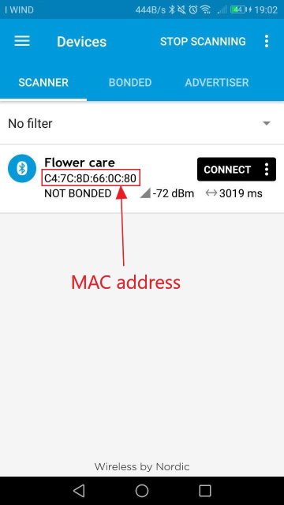

# ESP32 Flower Care sensor
**Tested with Xiaomi firmware 3.1.8**

This library allow your ESP32 to request data from [Xiaomi Flower sensor](http://www.huahuacaocao.com/product)

### Prerequisites

Before using this library install BLE library. You can find it [HERE](https://github.com/nkolban/ESP32_BLE_Arduino)

### Installing (Arduino IDE)

For Arduino IDE installation follow the [Arduino Guide](https://www.arduino.cc/en/Guide/Libraries#toc4) to install it as a ZIP file. Be sure to match all the prerequisites defined in the previous paragraph

## Flower Care MAC address
To discover the address of your flower care you can download the [nRF Connect app](https://play.google.com/store/apps/details?id=no.nordicsemi.android.mcp&hl=it) on your android phone.

### nRF Connect usage
* install the app
* turn on the bluetooth on your smartphone and open the app
* in the **scanner** tab you will see Flower Care device and the MAC address
* use this address in the [example](https://github.com/Brunez3BD/ESP32_FlowerCare/blob/master/example/FlowerCare_getData.cpp)  
`#define FLORA_ADDR "XX:XX:XX:XX:XX:XX"`

## License

This project is  is licensed under the GNU General Public License v3.0 - see the [LICENSE](LICENSE) file for details

#### README in progress
